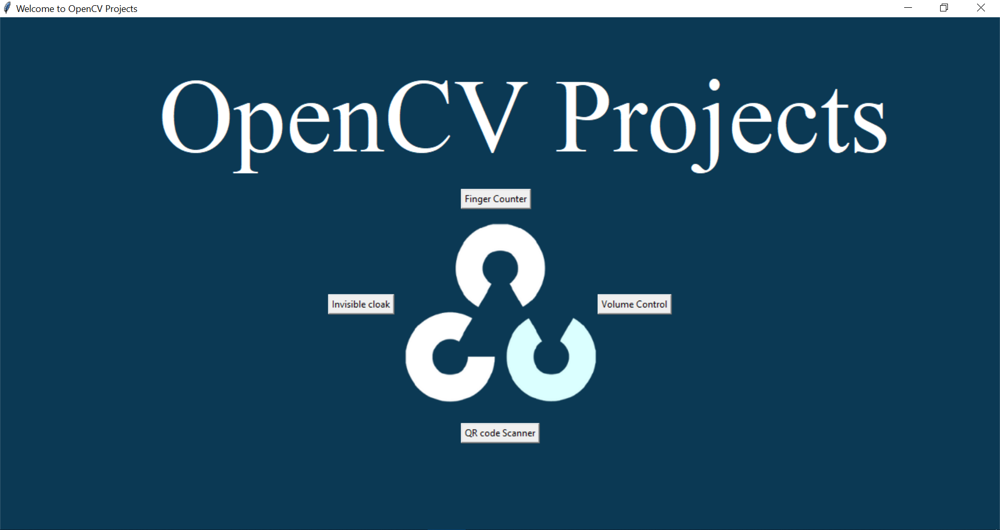
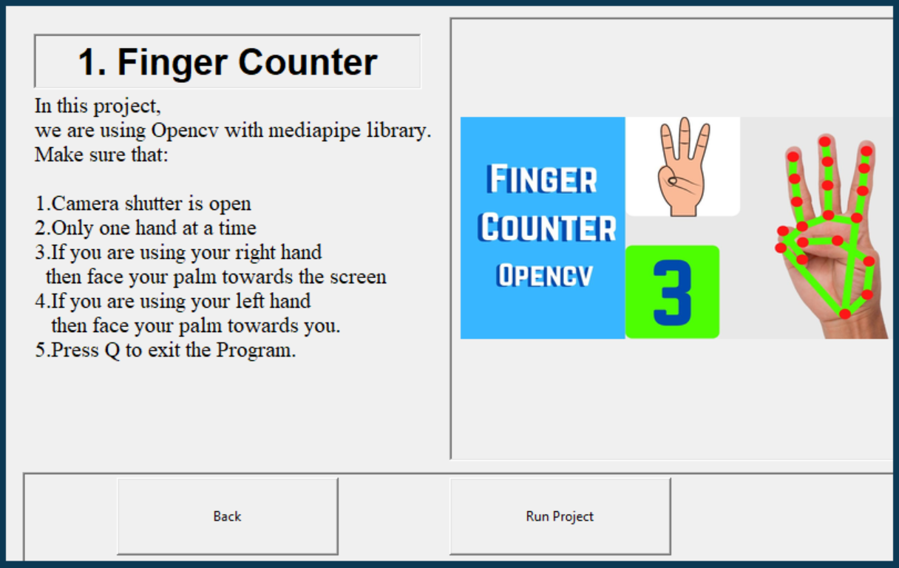
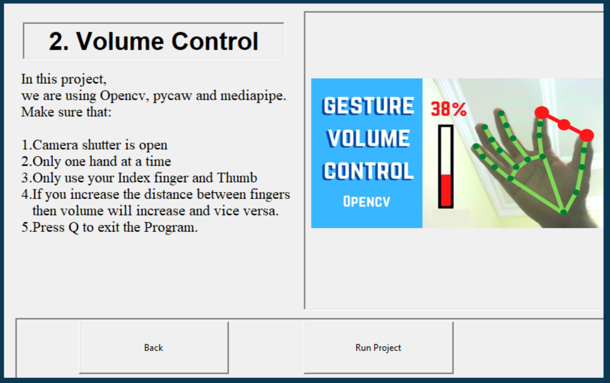
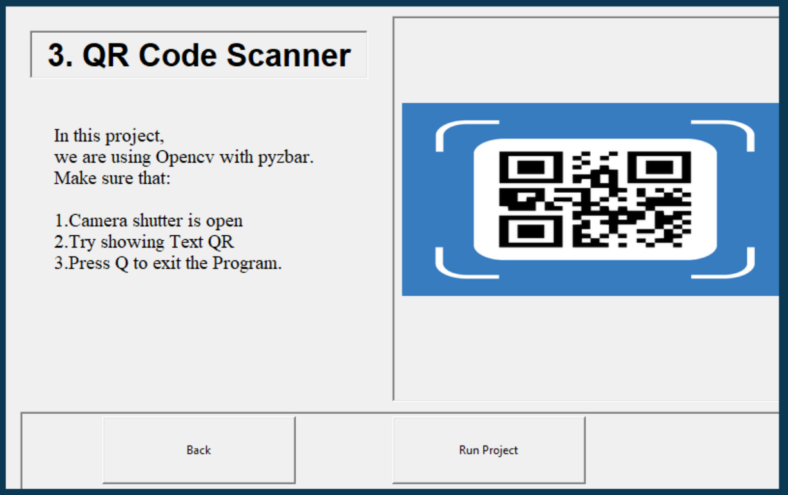
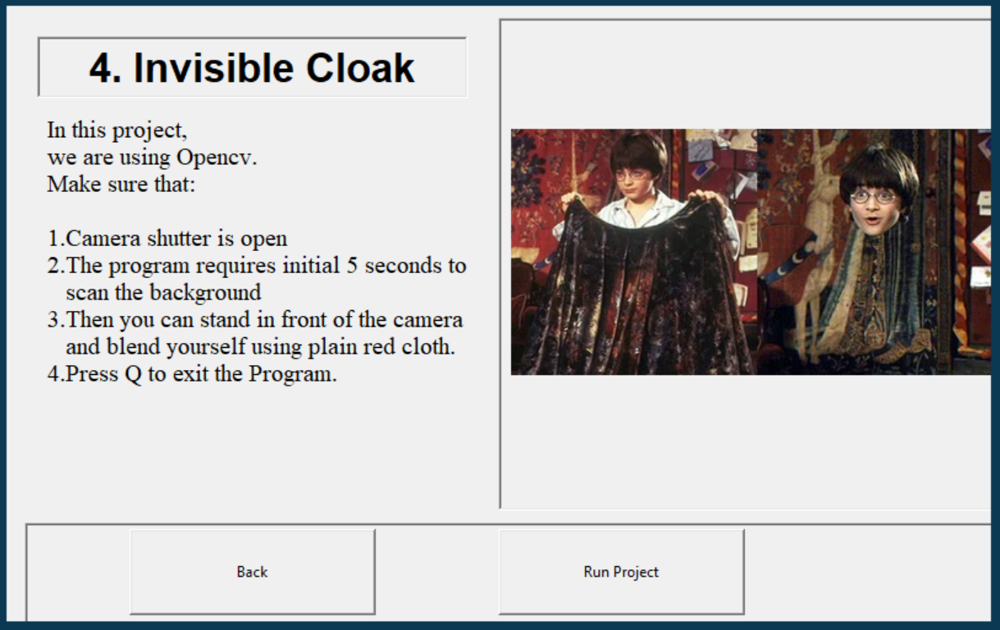

# Tkinter-OpenCV
## Project Using Tkinter, Opencv, Mediapipe 

This is a python GUI program using Tkinter which consist of 4 OpenCV projects

### 1. Finger Counter 
This program counts the number of fingers(0, 1, 2, 3, 4, 5) when showed in front of camera

### 2. Volume Gesture Control 
Controls the volume of your computer using the distance between Thumb and the Index finger

### 3. QR Code Scanner 
Scans basic text QR Codes and displays the text embedded 

  
### 4. Invisible Cloak 
User can blend in a steady environment using any RED cloth 

